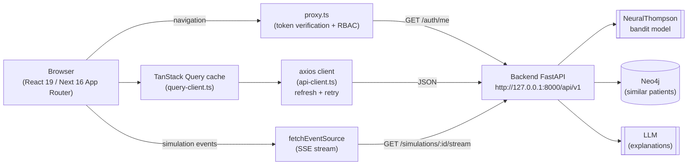
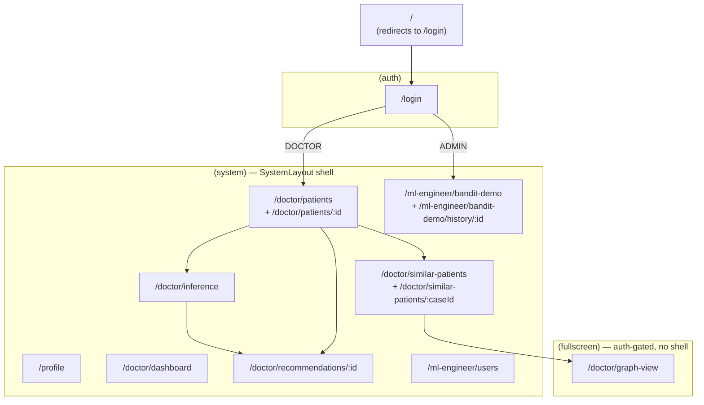
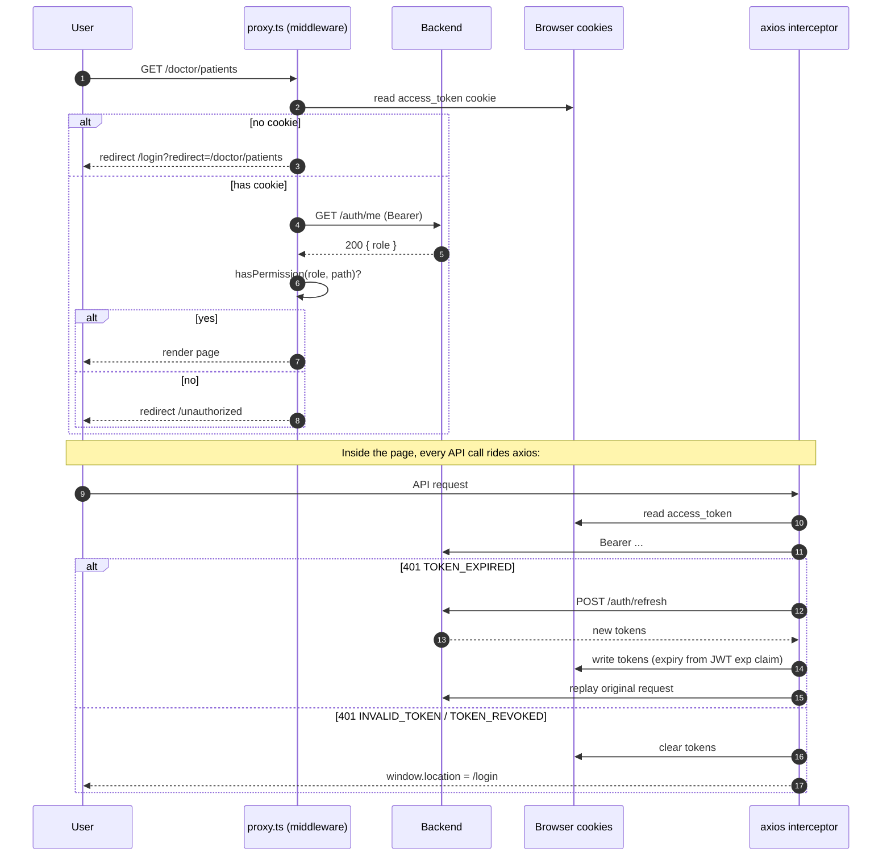
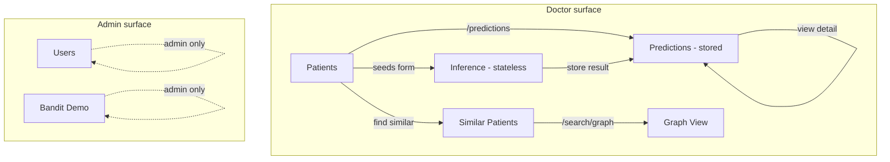
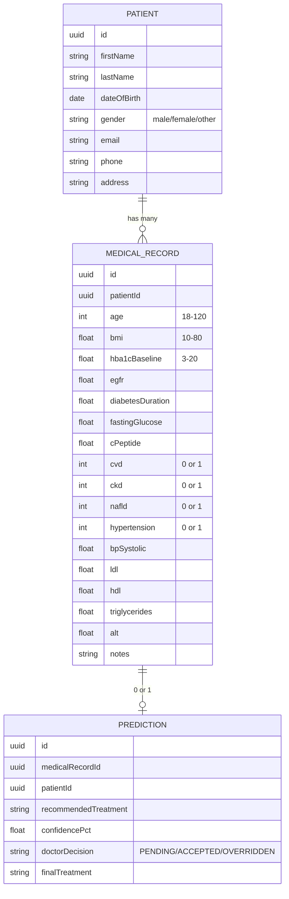
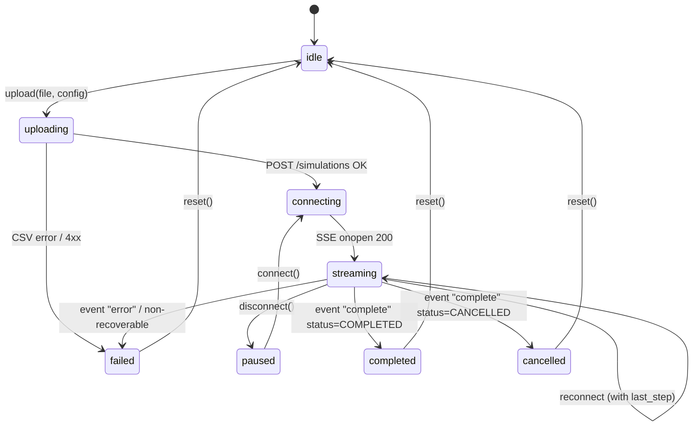
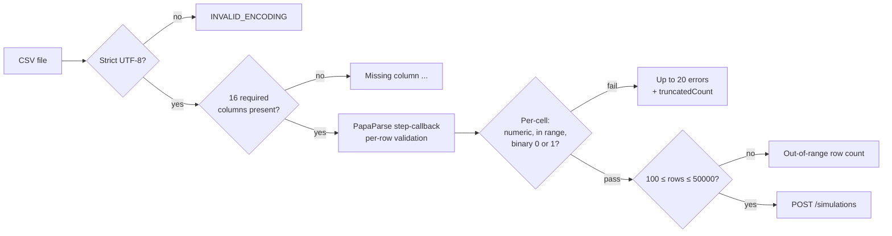
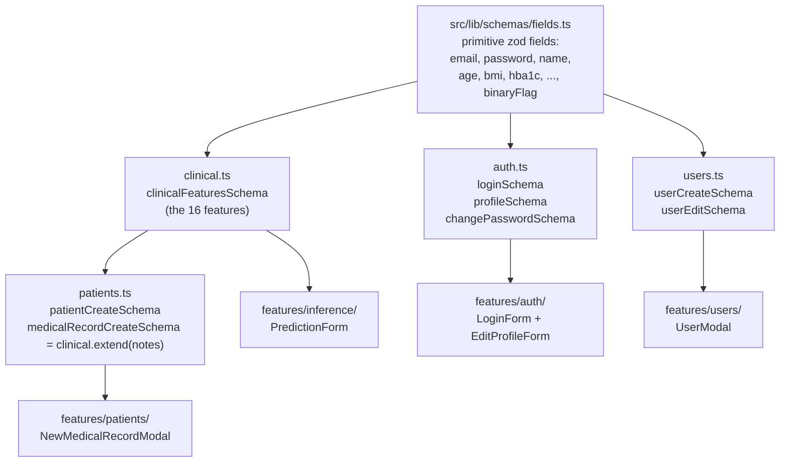
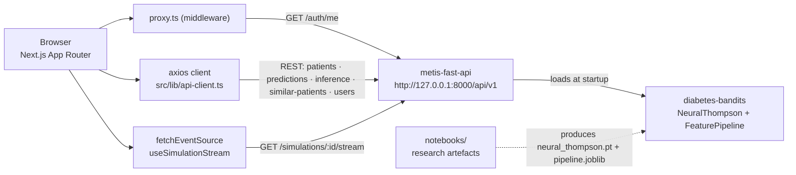

# Metis — Desktop App (`metis_ui`)

> **Repository:** <https://github.com/kudzaiprichard/metis_ui>
> **Role in Metis:** the user-facing client. Talks to
> [`metis-fast-api`](https://github.com/kudzaiprichard/metis-fast-api) over REST + SSE;
> the model and its inference façade live in
> [`diabetes-bandits`](https://github.com/kudzaiprichard/diabetes-bandits).

A Next.js 16 / React 19 frontend for an AI-powered Type-2 diabetes treatment decision-support
platform. Clinicians work with patient records and a NeuralThompson contextual-bandit model;
admins manage user accounts and run live bandit simulations from CSV datasets.

> **Tagline (from `app/layout.tsx` metadata):** *"AI-powered diabetes treatment optimization platform."*

This project is a thin client. All ML work, persistence, similarity search (Neo4j), and
LLM-generated explanations live behind a separate FastAPI backend that this app talks to over
HTTP + SSE. The codebase is structured so that the wire contract — documented inline in the
type files as **"spec §X"** references — is the single source of truth.

### Why this repo exists as a separate component

The UI is decoupled from training, persistence, and inference so that clinicians can iterate
on the surface (forms, the graph view, the bandit-demo SSE timeline) without touching the
model or the database layer. Every feature module owns its API DTOs in lock-step with the
backend's spec, and a strict adapter at every external boundary (`normalizeGraphResponse`,
`adaptGraphResponse`, the `pageSize` / `totalPages` re-shape in each `*.api.ts`) keeps
serialiser drift from leaking into component code. See [How this repo connects to the rest
of Metis](#how-this-repo-connects-to-the-rest-of-metis) for the exact data flow.

---

## Table of contents

- [Quick start](#quick-start)
- [Stack at a glance](#stack-at-a-glance)
- [High-level architecture](#high-level-architecture)
- [Repository layout](#repository-layout)
- [Routing and route groups](#routing-and-route-groups)
- [Authentication and authorization](#authentication-and-authorization)
- [API client and error handling](#api-client-and-error-handling)
- [Feature modules](#feature-modules)
  - [Auth](#auth)
  - [Users (admin)](#users-admin)
  - [Patients](#patients)
  - [Inference](#inference)
  - [Recommendation / Predictions](#recommendation--predictions)
  - [Similar Patients](#similar-patients)
  - [Graph View](#graph-view)
  - [Bandit Demo](#bandit-demo)
- [Validation: the 16 clinical features](#validation-the-16-clinical-features)
- [Design system](#design-system)
- [Scripts and tooling](#scripts-and-tooling)
- [Contributing](#contributing)
- [Known caveats and gotchas](#known-caveats-and-gotchas)

---

## Quick start

```bash
npm install
npm run dev          # http://localhost:3000
```

The dev server expects the backend at `http://127.0.0.1:8000/api/v1` (see
`src/lib/constants.ts → API_CONFIG.DEV_BASE_URL`). For production builds,
`NEXT_PUBLIC_API_BASE_URL` must be set.

> Note: `.env.local` currently sets `NEXT_PUBLIC_API_URL` (unused) — only
> `NEXT_PUBLIC_API_BASE_URL` is read by `getApiBaseUrl()`. This appears to be a
> stale env var; verify before deploying.

| Script                  | What it does                                             |
| ----------------------- | -------------------------------------------------------- |
| `npm run dev`           | Next.js dev server                                       |
| `npm run build`         | Production build                                         |
| `npm run start`         | Serve the production build                               |
| `npm run lint`          | ESLint (Next vitals + TS rules; warns on files > 600 LOC) |
| `npm run check:contrast` | Audits design tokens in `app/globals.css` for WCAG AA   |
| `npm run format`        | Prettier across `src/` and `app/`                        |

---

## Stack at a glance

- **Next.js 16** App Router, React 19, TypeScript (strict).
- **TanStack Query v5** for server state, with global defaults in `src/lib/query-client.ts`
  (5-min stale time, no 4xx retries, exponential backoff on 5xx/network).
- **Axios** + interceptors for the JSON API (`src/lib/api-client.ts`).
- **`@microsoft/fetch-event-source`** for the bandit simulation SSE stream
  (axios cannot stream EventSource frames cleanly).
- **Zod 4** form schemas under `src/lib/schemas/`, integrated with **react-hook-form**
  via `@hookform/resolvers`.
- **shadcn/ui (new-york)** primitives in `src/components/shadcn/`, **Radix UI** under the
  hood, **Tailwind v4** for styling.
- **D3 (force / hierarchy)** for the similar-patient graph layout helpers.
- **Recharts** for bandit-demo metrics.
- **PapaParse** for client-side CSV validation matching the backend rules byte-for-byte.
- **Sonner** for ad-hoc toasts; a custom toast provider for in-tree messaging
  (`src/components/shared/ui/toast/`).
- **`@axe-core/react`** loaded only in dev (`AxeBoot.tsx`) to catch a11y regressions.
- **Geist Sans / Geist Mono** via `next/font/google`.

---

## High-level architecture



- The **proxy** (Next.js middleware in `proxy.ts`) sits in front of every page request, calls
  `GET /auth/me` to verify the access cookie, then enforces role-based route allowlists from
  `ROUTE_PERMISSIONS` in `src/lib/constants.ts`.
- The **axios client** owns one interceptor pipeline that turns the backend's
  `{ success, value, error }` envelope into typed `ApiError` objects, handles silent token
  refresh on `TOKEN_EXPIRED`, and short-circuits to `/login` on revoked/invalid tokens.
- The **SSE path** intentionally bypasses axios because `fetchEventSource` is the only client
  that handles auth headers + auto-resume on `last_step` reconnection cleanly.

---

## Repository layout

```
metis_desktop_app/
├─ app/                       # Next.js App Router (pages only — no business logic)
│  ├─ layout.tsx              # Root: backdrop + Providers + ToastBridge
│  ├─ page.tsx                # → redirects to /login
│  ├─ globals.css             # Design tokens (medical-green dark theme)
│  ├─ global-error.tsx
│  ├─ not-found.tsx
│  ├─ unauthorized/page.tsx
│  ├─ (auth)/                 # Public auth surface — own layout, no shell
│  │   └─ login/
│  ├─ (fullscreen)/           # Authenticated pages without the ribbon shell
│  │   └─ doctor/graph-view/
│  └─ (system)/               # Authenticated pages WITH the SystemLayout shell
│      ├─ doctor/
│      │   ├─ dashboard/
│      │   ├─ patients/[id]/
│      │   ├─ inference/
│      │   ├─ recommendations/[id]/
│      │   └─ similar-patients/[caseId]/
│      ├─ ml-engineer/
│      │   ├─ users/
│      │   └─ bandit-demo/history/[id]/
│      └─ profile/
├─ proxy.ts                   # Next.js middleware: token verify + RBAC
├─ src/
│  ├─ components/
│  │   ├─ shadcn/             # shadcn/ui primitives (do not hand-edit)
│  │   ├─ shared/             # AnimatedBackdrop, Splash, PageLoader, custom Toast
│  │   ├─ providers/          # QueryClient + Toast + Auth + AxeBoot wrappers
│  │   └─ layout/             # SystemLayout (ribbon menu, breadcrumb, top actions)
│  ├─ features/               # One folder per business capability — see "Feature modules"
│  │   ├─ auth/
│  │   ├─ users/
│  │   ├─ patients/
│  │   ├─ inference/
│  │   ├─ recommendation/     # Stored predictions (folder name is legacy)
│  │   ├─ similar-patients/
│  │   ├─ graph-view/         # Pure render module — fed by similar-patients adapter
│  │   └─ bandit-demo/
│  └─ lib/
│      ├─ api-client.ts       # Axios + interceptors
│      ├─ axios.d.ts          # Augments InternalAxiosRequestConfig with _skipAuthRetry
│      ├─ constants.ts        # API_ROUTES, ROUTE_PERMISSIONS, ERROR_CODES, USER_ROLES
│      ├─ query-client.ts     # TanStack Query defaults + queryKeys factory
│      ├─ types.ts            # ApiResponse / PaginatedResponse / ApiError
│      ├─ schemas/            # Zod form schemas (auth, clinical, fields, patients, users)
│      └─ utils/              # auth, theme, toast-bridge, cn()
├─ scripts/check-contrast.mjs # WCAG AA audit for design tokens
├─ next.config.ts             # Empty — defaults
├─ tsconfig.json              # `@/*` → repo root
├─ eslint.config.mjs          # next/core-web-vitals + TS, max-lines warning at 600
└─ components.json            # shadcn config
```

Each feature folder follows the same convention:

```
features/<name>/
├─ api/                       # Thin axios wrappers + DTOs that mirror the backend spec
│  ├─ <name>.api.ts
│  └─ <name>.types.ts
├─ hooks/                     # React Query hooks — single source of cache keys per feature
├─ components/                # UI for the feature; further subdivided by surface (list/detail/...)
└─ lib/                       # Pure helpers (adapters, validation, etc.) — only when needed
```

---

## Routing and route groups

The app uses Next.js App Router **route groups** to attach different layouts without
affecting URLs:

| Route group     | Layout                                | Purpose                                  |
| --------------- | ------------------------------------- | ---------------------------------------- |
| `app/(auth)`    | Plain `<main>` + AnimatedBackdrop     | Login page (no ribbon, no auth gate)     |
| `app/(fullscreen)` | Auth-gated `<main>`, full viewport | Graph View — needs all the pixels        |
| `app/(system)`  | `SystemLayout` — ribbon + breadcrumb  | Every other authenticated page           |



Per `useLogin()` in `src/features/auth/hooks/useAuth.ts`, the post-login landing page is:

- `DOCTOR` → `/doctor/patients`
- `ADMIN` → `/ml-engineer/bandit-demo`

A `?redirect=` query param is honoured **only if it's valid for the user's role** —
otherwise the user is sent to the role's default landing page and the attempt is logged.

---

## Authentication and authorization

Auth is split between three layers — no single layer is sufficient on its own:



- **`proxy.ts`** (Next.js middleware) — runs on every non-static route, calls `GET /auth/me`
  to verify the cookie, then matches the path against `ROUTE_PERMISSIONS` from
  `src/lib/constants.ts`. The middleware **does NOT cache** auth checks (`cache: 'no-store'`).
- **Axios response interceptor** — branches on the spec's machine-readable `error.code`,
  not just HTTP status (since `INVALID_CREDENTIALS` and `TOKEN_REVOKED` are both `401`).
  Only `TOKEN_EXPIRED` is refresh-recoverable. Login uses `_skipAuthRetry: true` so wrong
  credentials don't trigger a refresh attempt.
- **Token storage** — JWT pair in cookies (`access_token`, `refresh_token`), `sameSite=lax`,
  `secure` only in production. Cookie expiry is **derived from the JWT's `exp` claim**
  (the backend ships plain JWT strings without `expires_at`); see `decodeJwtExpiry()` in
  `src/lib/utils/auth.ts` and `api-client.ts`.

### RBAC matrix (from `ROUTE_PERMISSIONS`)

| Path prefix              | DOCTOR | ADMIN |
| ------------------------ | :----: | :---: |
| `/dashboard`             |   ✅   |  ✅   |
| `/patients`              |   ✅   |  ✅   |
| `/predictions`           |   ✅   |  ✅   |
| `/similar-patients`      |   ✅   |  ✅   |
| `/monitoring`            |   ✅   |  ✅   |
| `/users`                 |   ❌   |  ✅   |
| `/models`, `/training`   |   ❌   |  ✅   |
| `/ml-engineer/bandit-demo` |   ❌   |  ✅   |

> `/dashboard`, `/predictions`, `/monitoring`, `/models`, `/training` are reserved in the
> permission map but the actual routes live under `/doctor/...` and `/ml-engineer/...`.
> The `(system)` route group is invisible to the proxy, so `/ml-engineer/bandit-demo` is
> the literal path it sees — see the inline comment in `constants.ts:34-40`.

Self-registration is intentionally **disabled** — there is no public `/register` page and
no `useRegister` hook. New accounts are admin-created via `POST /users`.

---

## API client and error handling

Every endpoint goes through `src/lib/api-client.ts`. The client unwraps the backend
envelope so callers get `T` directly:

```ts
// Backend ships:
//   { success: true, value: T, message?: string }
//   { success: false, error: { title, code, status, details, fieldErrors }, message?: string }

const user = await apiClient.get<User>('/auth/me');         // → User
await apiClient.post<void, LoginRequest>('/auth/login', x); // → unwrapped value
```

`success: false` (whether returned in a 200 or as an HTTP error) is converted to an
`ApiError` (see `src/lib/types.ts`) with helpers:

- `error.getMessage()` — the main user-facing message.
- `error.getFullMessage()` — message + details + per-field errors flattened.
- `error.getFieldErrors(field)` — for form-level validation.
- `error.code` — branch on `ERROR_CODES.*` from `constants.ts`.

Pagination has two flavours that callers normalise per-feature:

- `apiClient.getPaginated<T>(...)` — for `GET` list endpoints.
- `apiClient.postPaginated<T, D>(...)` — for the similar-patients tabular search.

Both return `{ items, pagination }`; the `pagination` object's casing is loose because the
shared helper still has the legacy snake_case fallback typed in. **Each feature's API file
re-shapes pagination into camelCase** (`pageSize`, `totalPages`) before returning, so
component code reads one canonical shape — see e.g. `patients.api.ts:51-75`.

### Error code surface

`src/lib/constants.ts → ERROR_CODES` is the exhaustive set of codes the UI branches on.
Highlights:

- **400**: `VALIDATION_ERROR`, `RECORD_PATIENT_MISMATCH`, `TREATMENT_REQUIRED`,
  `CSV_VALIDATION_FAILED`, `INVALID_FILE_TYPE`, `INVALID_ENCODING`.
- **401**: `INVALID_CREDENTIALS` (wrong password — passes through), `TOKEN_EXPIRED`
  (triggers refresh), `TOKEN_REVOKED`/`INVALID_TOKEN`/`INVALID_TOKEN_TYPE`
  (clear cookies, redirect).
- **403**: `ACCOUNT_INACTIVE`, `INSUFFICIENT_ROLE`.
- **404**: domain-specific — `PATIENT_NOT_FOUND`, `RECORD_NOT_FOUND`,
  `PREDICTION_NOT_FOUND`, `SIMULATION_NOT_FOUND`, `USER_NOT_FOUND`.
- **409**: `EMAIL_EXISTS`, `USERNAME_EXISTS`, `MAX_SIMULATIONS_REACHED`,
  `SIMULATION_NOT_RUNNING`, `SIMULATION_RUNNING` (returned on DELETE while running).
- **500/503**: `MODEL_NOT_FOUND`, `EXPLANATION_FAILED`, `SERVICE_UNAVAILABLE`.
- **Client-synthesized**: `NETWORK_ERROR`, `REQUEST_FAILED`.

> Wire convention: response DTOs are **camelCase**; request bodies are **snake_case**
> (Pydantic field names). The exception is the similar-patients **graph endpoint**, where
> node `data` payloads still arrive snake_case and need to be normalised at the boundary
> (`similar-patients.api.ts:151-315`).

---

## Feature modules



Each feature module owns its API, types, hooks, and UI. Components do not call
`apiClient` directly — they go through the React Query hooks in
`features/<name>/hooks/`.

### Auth

`src/features/auth/`

- **API**: `POST /auth/login`, `POST /auth/logout`, `POST /auth/refresh`, `GET /auth/me`,
  `PATCH /auth/me`.
- **Hooks**: `useLogin`, `useLogout`, `useCurrentUser`, `useAuth`, `useUpdateMe`.
- **Pages**: `app/(auth)/login`, `app/(system)/profile`.
- Roles enum is defined twice on purpose:
  - `src/lib/constants.ts → USER_ROLES` (string-const, used by `ROUTE_PERMISSIONS`).
  - `src/features/auth/api/auth.types.ts → UserRole` (TS enum, used by UI logic).
  - `normalizeUserRole()` accepts `"DOCTOR"`, `"DR"`, `"ADMIN"` (case-insensitive) and
    falls back to `DOCTOR`.

### Users (admin)

`src/features/users/` — admin-only. Calls `POST/GET/PATCH/DELETE /users` (see
`API_ROUTES.USERS`). Delete is **permanent** — there is no restore endpoint, despite a
historical `RESTORE` route in `API_ROUTES`.

### Patients

`src/features/patients/` — clinician CRUD over patient demographics + medical records.

Endpoints (spec §5):

- `POST /patients`, `GET /patients`, `GET /patients/{id}` (detail with eager
  `medicalRecords`), `PATCH /patients/{id}`, `DELETE /patients/{id}`.
- `POST/GET /patients/{id}/medical-records`, `GET /patients/{id}/medical-records/{recordId}`.

Pagination params for the list are `page` / `pageSize` (camelCase per spec §3.2);
medical-records list uses `skip` / `limit` (≤100). All deletes cascade — there is no
soft-delete or restore endpoint.



> Binary comorbidity flags (`cvd`, `ckd`, `nafld`, `hypertension`) travel as **integers
> 0/1**, not booleans, on every endpoint — except inside `PredictionResponse.patient`
> where the inference module formats them as `"Yes"/"No"` strings. See the comment in
> `inference.types.ts:1-13`.

### Inference

`src/features/inference/` — stateless ML inference. Nothing is persisted.

| Endpoint                              | Hook                          | Returns                                    |
| ------------------------------------- | ----------------------------- | ------------------------------------------ |
| `POST /inference/predict`             | `usePredict`                  | `PredictionResponse`                       |
| `POST /inference/predict-with-explanation` | `usePredictWithExplanation` | `PredictionResponse` + LLM `explanation` |
| `POST /inference/explain`             | `useExplain`                  | `ExplanationResponse` (no model re-run)    |
| `POST /inference/predict-batch`       | `usePredictBatch`             | `PredictionResponse[]` (cap 50)            |

`PredictionResponse` is a 4-section payload — `patient`, `decision`, `safety`, `fairness`
— see `inference.types.ts`. Confidence tiers (HIGH ≥85%, MODERATE 60–84%, LOW <60%) and
safety statuses (`CLEAR`, `WARNING`, `CONTRAINDICATION_FOUND`) come from the backend.

The form (`PredictionForm.tsx`) is driven by `feature-schema.ts`, which mirrors the spec's
ranges and groups them into Demographics / Vitals / Diabetes / Kidney & Liver / Lipids
panels. **Recent predictions** are stored device-locally in `localStorage` via
`features/inference/lib/recent-predictions.ts` — the inference module is stateless on the
server, so the rail is a UX-only convenience.

The five treatment labels are fixed:

```
Metformin · GLP-1 · SGLT-2 · DPP-4 · Insulin
```

### Recommendation / Predictions

`src/features/recommendation/` — folder name is legacy; the module is authoritatively
**Predictions** in the spec.

Endpoints (spec §5):

- `POST /predictions` — store a prediction against an existing medical record.
- `GET /predictions/{id}` — fetch one.
- `PATCH /predictions/{id}/decision` — record the doctor's `ACCEPTED` or `OVERRIDDEN`
  decision. When `OVERRIDDEN`, `final_treatment` is required (server-enforced).
- `GET /predictions/patient/{patient_id}` — paginated history for a patient.

> The stored `explanation` object uses **different field names** from the inference
> module's `ExplanationResponse` — see the warning at the top of
> `recommendations.types.ts:1-14`. Don't substitute one for the other.

The detail page is a widget-driven dashboard:

- `PredictionHero` + `KeyStatsStrip` — recommendation, confidence, runner-up, decision state.
- `TreatmentPodium` + `PosteriorMeansWidget` — the bandit's posterior over the 5 treatments.
- `DoctorDecisionPanel` — accept / override + free-text notes.
- `PredictionSafetyPanel`, `PredictionFairnessPanel`, `StoredExplanationPanel` —
  narrative explanation of the decision.

### Similar Patients

`src/features/similar-patients/` — Neo4j-backed cohort retrieval.

Endpoints:

- `POST /similar-patients/search` — paginated tabular search (`SimilarPatientCase[]`).
- `POST /similar-patients/search/graph` — graph-shaped response for the visualisation.
- `GET /similar-patients/{caseId}` — full case detail.

Search criteria come from a side panel: `patient_id` **or** `medical_record_id`, optional
`treatment_filter[]`, `min_similarity` (0–1), and `limit`. Results show `clinicalSimilarity`
+ `comorbiditySimilarity` separately so clinicians can tell why two cases scored as similar.

#### The graph endpoint is the lone outlier

> Memory note (verified in code): `/similar-patients/search/graph` is the only endpoint
> that violates the codebase's camelCase response convention. Patient/treatment/outcome
> node `data` payloads arrive **snake_case**, outcome data lives on a **separate** node,
> and `metadata.filtersApplied` is an object rather than `string[]`.
>
> `normalizeGraphResponse()` in `similar-patients.api.ts:151-315` is the boundary
> normaliser that fixes all four problems before any UI code sees the response. **Do not
> bypass it** — components downstream rely on the normalised shape.

### Graph View

`src/features/graph-view/` — the rendering module the fullscreen graph page consumes.

It is **fed by** the similar-patients module: `adaptGraphResponse()` in
`graph-view/lib/adapters.ts` takes a normalised `SimilarPatientsGraphResponse` and emits
the layout-ready `GraphViewData`. Adapters are intentionally **strict** — missing fields
throw rather than fall back to sentinel values, so loader / serializer regressions surface
during development instead of producing silently broken canvases.

Four layouts (keyboard-shortcut switchable: `1`–`4`):

| Key | Layout    | Description                                                       |
| --- | --------- | ----------------------------------------------------------------- |
| `1` | `force`   | Treatments on a ring, patients orbit in golden-angle distribution |
| `2` | `tree`    | Treatments as columns sorted by success rate                      |
| `3` | `cluster` | Concentric rings of patients around each treatment                |
| `4` | `outcome` | Patients bucketed into success/partial/failure columns            |
| `0` | fit       | Reset zoom + pan                                                  |
| `+/-` | zoom    | Zoom in / out                                                     |
| `Esc` | deselect | Close the inspector                                              |

The page lives at `/doctor/graph-view?patientId=...&medicalDataId=...&limit=...&minSimilarity=...&treatmentFilter=...`.

### Bandit Demo

`src/features/bandit-demo/` — admin-only NeuralThompson simulation surface. The user
uploads a CSV, the backend runs the bandit one row at a time, and the UI watches via SSE.



#### CSV ingest and validation



`features/bandit-demo/lib/csv-validation.ts` mirrors the backend's contract byte-for-byte
(spec §6.2) so users get specific error messages at file-select time instead of a single
`CSV_VALIDATION_FAILED` rejection from the server. Validation is streaming (no full file
buffering); errors are capped at 20 with an overflow counter.

#### SSE stream

`useSimulationStream.ts` owns the entire lifecycle: upload, connect, reconnect with
`?last_step=N`, silent token refresh on 401/403, and an explicit `cancel()` that sends
`POST /simulations/{id}/cancel` and waits for the `complete` event. Network errors trigger
a 3-second backoff reconnect; manual aborts (pause/cancel/unmount) suppress the retry.

Three SSE event types:

- `step` — per-row decision (selected treatment, ε, posterior estimates, running metrics).
- `ping` — keep-alive, ignored.
- `complete` — terminal event with final aggregates (or `cancelled_at_step` if cancelled).
- `error` — terminal failure.

#### Cancel-then-delete

`DELETE /simulations/{id}` returns `SIMULATION_RUNNING` (409) while the simulation is
running. The hook surface (`useDeleteSimulation`, `useCancelSimulation`) exposes the
primitives; `DeleteSimulationDialog.tsx` orchestrates cancel → wait-for-status → delete.

---

## Validation: the 16 clinical features

The same 16 features feed both the **inference form** and the **medical-record form**, so
the schema is composed in one place and reused:



Field ranges (from `fields.ts`, mirrored in `csv-validation.ts` and `feature-schema.ts`):

| Feature              | Range / Type           | Unit          |
| -------------------- | ---------------------- | ------------- |
| `age`                | 18–120 integer         | years         |
| `bmi`                | 10–80                  | kg/m²         |
| `bp_systolic`        | 60–250                 | mmHg          |
| `hba1c_baseline`     | 3–20                   | %             |
| `diabetes_duration`  | 0–60                   | years         |
| `fasting_glucose`    | 50–500                 | mg/dL         |
| `c_peptide`          | 0–10                   | ng/mL         |
| `egfr`               | 5–200                  | mL/min/1.73m² |
| `alt`                | 5–500                  | U/L           |
| `ldl`                | 20–400                 | mg/dL         |
| `hdl`                | 10–150                 | mg/dL         |
| `triglycerides`      | 30–800                 | mg/dL         |
| `cvd, ckd, nafld, hypertension` | `0` or `1`  | binary        |

If a constraint changes, change it in `fields.ts` — every form will pick it up.

---

## Design system

- Single dark theme (`:root` in `app/globals.css` mirrors `.dark`). The brand is "medical
  green": `--primary: #10b981`, background `#0a1210 → #132a22` gradient, glassy cards
  (`rgba(20, 45, 35, 0.3)` + backdrop blur).
- A drifting molecular grid + spotlight backdrop is rendered system-wide in `RootLayout`
  via `<AnimatedBackdrop />`, so every route inherits the same atmosphere.
- Type scale uses a custom 5-step ramp (`--text-xs` 10px through `--text-2xl` 28px); a
  `--text-md` 14px slot fills the gap Tailwind v4 leaves between `sm` and `lg`.
- Chart colours are semantic CSS variables `--chart-1`…`--chart-5` (`oklch()`); the bandit
  demo's `TREATMENTS` array references these by `var(--chart-N)` so the palette tracks
  the design tokens.
- `prettier-plugin-tailwindcss` is enabled. Class-name composition uses
  `tailwind-merge` + `clsx` via the `cn()` helper in `src/lib/utils/utils.ts`.
- ESLint warns on files >600 LOC (`eslint.config.mjs`) — flag rather than fail.
- A11y: `eslint-plugin-jsx-a11y` is on, and `AxeBoot.tsx` lazily loads `@axe-core/react`
  in dev to surface violations in the console. `npm run check:contrast` audits the
  documented foreground/background pairs against WCAG AA.

---

## Scripts and tooling

| File                          | Why it exists                                                      |
| ----------------------------- | ------------------------------------------------------------------ |
| `proxy.ts`                    | Next.js middleware: token verify + RBAC                            |
| `src/lib/api-client.ts`       | Single axios instance with refresh + RBAC error mapping            |
| `src/lib/query-client.ts`     | TanStack Query defaults — central place to tune caching/retry      |
| `src/lib/schemas/`            | Zod source of truth for every form                                 |
| `scripts/check-contrast.mjs`  | Parses `globals.css` and asserts WCAG AA pairs                     |
| `eslint.config.mjs`           | next/core-web-vitals + TS + max-lines warning                      |
| `components.json`             | shadcn config (style: new-york; alias `@/src/components`)          |

Path aliases (`tsconfig.json` + `components.json`):

| Alias                   | Resolves to                  |
| ----------------------- | ---------------------------- |
| `@/*`                   | repo root                    |
| `@/src/components`      | shadcn primitives + shared UI |
| `@/src/components/shadcn` | shadcn primitives only      |
| `@/src/lib`             | api-client, types, schemas, utils |
| `@/src/lib/utils/utils` | the `cn()` helper            |

---

## Contributing

1. **Don't call `apiClient` from components.** Always go through a feature hook in
   `features/<name>/hooks/`. The hook is where invalidation, optimistic updates, and
   query keys live.

2. **Don't duplicate validation rules.** Compose new form schemas from `src/lib/schemas/fields.ts`.
   If a constraint changes, change it there.

3. **Keep the API DTO files in sync with the spec.** Comments referencing "spec §X" point
   at the backend's authoritative spec — when a DTO drifts, update the typedef *and* the
   spec reference. Do **not** loosen types to `any` to silence a drift; the codebase
   relies on strict types throwing fast (see the strict adapters in
   `graph-view/lib/adapters.ts` and `similar-patients.api.ts`).

4. **Pagination shape**: each feature's API file is responsible for normalising into
   `{ page, pageSize, total, totalPages }` (camelCase) before returning. Components
   should never read `page_size` / `total_pages`.

5. **Cookies, not localStorage, for tokens.** Adding a `localStorage` token store will
   break the proxy because middleware can't read `localStorage`.

6. **The `recommendation/` folder is named that way for legacy reasons.** New code should
   refer to it as the **Predictions** module, matching the spec and `API_ROUTES.PREDICTIONS`.

7. **Linter expects ≤600 lines per file.** It's a warning, not an error — but it's a
   strong hint to split the surface (and the audit referenced in `eslint.config.mjs`
   asked for it explicitly).

8. **Commit style** (from `git log`): conventional-commits (`feat`, `fix`, `refactor`,
   `chore`) with a feature-scoped prefix, e.g. `refactor(lib): ...`, `feat(schemas): ...`.

---

## Known caveats and gotchas

These are real, live in the code today, and worth knowing before you change something:

- **The graph endpoint is the lone snake_case outlier.** `searchGraph()` runs every
  response through `normalizeGraphResponse()`. If you add a new node `data` field on the
  backend, register it in `SNAKE_TO_CAMEL` in `similar-patients.api.ts:78-95` or it will
  surface as a snake_case key in component code.

- **`api-client.ts` logs every request.** There's `console.log` instrumentation on every
  GET/POST/PUT/PATCH/DELETE. Useful in dev; consider stripping for prod builds.

- **Two `refreshToken` flows exist.** `api-client.ts` decodes the JWT `exp` claim;
  `useSimulationStream.ts` uses an older shape with `tokens.access_token.expires_at`.
  When both are exercised they should agree, but if the backend response shape settles,
  the SSE path needs to follow.

- **`dashboard-content.tsx` still pretty-prints the user object as raw JSON.** Looks like
  a debug surface that survived the `/doctor/dashboard` route. Probably fine — but it's
  not a real dashboard.

- **`.env.local` defines `NEXT_PUBLIC_API_URL`** which **isn't read anywhere**. The code
  reads `NEXT_PUBLIC_API_BASE_URL`. Verify in `src/lib/constants.ts:1-6` before changing.

- **`/auth/refresh` is called twice on failed refresh in `useSimulationStream`** — once
  in `onopen` and once in `onerror`. Both are guarded; in practice only one fires per
  reconnect cycle.

- **There is no test suite.** No unit, integration, or e2e tests are present in the repo.
  Manual verification is the only safety net today.

- **`queryKeys` factory in `query-client.ts` is partly aspirational.** It defines keys
  for `monitoring` and `models` but those features don't exist in the UI yet. Each
  feature's hooks file defines its own active keys.

---

## How this repo connects to the rest of Metis



### What flows in and out

| Other repo | Direction | What is exchanged |
|---|---|---|
| [`metis-fast-api`](https://github.com/kudzaiprichard/metis-fast-api) | outbound HTTP + SSE | Every page hits this API. JSON requests are **snake_case** (Pydantic field names); responses come wrapped in `{ success, value, error }` and are **camelCase** for `value` (with the documented exception of `/similar-patients/search/graph` — see [Similar Patients](#similar-patients)). The bandit-demo page consumes a Server-Sent-Events stream (`step` / `ping` / `complete` / `error`) for the live simulation timeline. JWT lives in cookies (`access_token` + `refresh_token`); refresh is silent on `TOKEN_EXPIRED`. |
| [`diabetes-bandits`](https://github.com/kudzaiprichard/diabetes-bandits) | indirect (through the API) | This repo never imports from `diabetes-bandits` directly — but the **5 fixed treatments** (`Metformin`, `GLP-1`, `SGLT-2`, `DPP-4`, `Insulin`) and the **16 clinical features** (with the same ranges) are owned upstream by `inference/_internal/constants.py` in that repo. `src/lib/schemas/fields.ts`, `features/inference/lib/feature-schema.ts`, and `features/bandit-demo/lib/csv-validation.ts` mirror those ranges byte-for-byte so the user sees specific in-page errors instead of a `CSV_VALIDATION_FAILED` round-trip. |

### When the wire contract changes

The codebase encodes the backend spec inline as `// spec §X` references. If the API
changes a response shape, an error code, or a pagination key:

1. Update the relevant `*.types.ts` and bump the `// spec §X` comment.
2. If the change affects 16-feature ranges or treatment ordering, update
   `src/lib/schemas/fields.ts` (the single source of truth) — every form picks it up.
3. If a new error code lands, add it to `src/lib/constants.ts → ERROR_CODES` and
   branch on it in the relevant feature's hook (do **not** branch on HTTP status alone —
   `INVALID_CREDENTIALS` and `TOKEN_REVOKED` are both `401`).
4. If the backend introduces a new snake_case payload (likely only on the graph
   endpoint), extend `SNAKE_TO_CAMEL` in `similar-patients.api.ts` rather than threading
   raw snake_case keys through the rest of the codebase.

---

## Related Repositories

| Repo | Role | One-line description |
|---|---|---|
| [`metis_ui`](https://github.com/kudzaiprichard/metis_ui) | Desktop client (this repo) | Next.js 16 / React 19 UI for clinicians and ML-engineer admins |
| [`metis-fast-api`](https://github.com/kudzaiprichard/metis-fast-api) | Backend service | FastAPI clinical workflow — auth, patients, predictions, similar-cases, bandit simulator + SSE |
| [`diabetes-bandits`](https://github.com/kudzaiprichard/diabetes-bandits) | ML research + inference | Neural-Thompson contextual bandit, training CLI, OPE, and the inference façade vendored into the backend |
